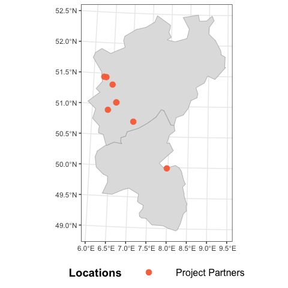

```
## 
## Attaching package: 'dplyr'
```

```
## The following objects are masked from 'package:stats':
## 
##     filter, lag
```

```
## The following objects are masked from 'package:base':
## 
##     intersect, setdiff, setequal, union
```

```
## ── Attaching core tidyverse packages ──────────────────────── tidyverse 2.0.0 ──
## ✔ forcats   1.0.0     ✔ stringr   1.5.1
## ✔ lubridate 1.9.3     ✔ tibble    3.2.1
## ✔ purrr     1.0.2     ✔ tidyr     1.3.1
## ── Conflicts ────────────────────────────────────────── tidyverse_conflicts() ──
## ✖ dplyr::filter() masks stats::filter()
## ✖ dplyr::lag()    masks stats::lag()
## ℹ Use the conflicted package (<http://conflicted.r-lib.org/>) to force all conflicts to become errors
## Linking to GEOS 3.11.0, GDAL 3.5.3, PROJ 9.1.0; sf_use_s2() is TRUE
## 
## 
## Attaching package: 'kableExtra'
## 
## 
## The following object is masked from 'package:dplyr':
## 
##     group_rows
```

# Location of Partners
These partners provide information, which is directly related to the Decision Analysis. 

However, we have also two partners in Bayern


``` r
partners <- data.frame(Partner = c("1", "2", "3", "4", "5", "6", "7", "8", "9","10"),
                Latitude = c("50.905235", "49.9847", "50.7292847", "48.2233187", "50.1086989", 
                             "51.4425624","51.0322072", "51.4375832", "51.3206", "51.0322072"),
                Longitude = c("6.4042735", "7.96835", "7.0731143", "11.592294", "11.4510019", 
                              "6.266977","6.6134963", "6.3253844", "6.4951", "6.6134963")
                )


# !reading the shapefile (the map)
# shapefiles are from eurostat, there are different versions, here i am using the version of 2021
# Source: https://ec.europa.eu/eurostat/de/web/gisco/geodata/statistical-units/territorial-units-statistics

shape <- read_sf(dsn = "map/German_Geo/NUTS_RG_20M_2021_3035.shp")
shape <- shape %>% dplyr::filter(CNTR_CODE == "DE",LEVL_CODE == 3)
names(shape)[4] <- "kreis"

# !transforming the soil point crs into the shapefile crs
maps <- partners %>% st_as_sf(coords = c("Longitude", "Latitude"), 
                               crs="+proj=longlat +datum=WGS84 +ellps=WGS84 +towgs84=0,0,0") %>% 
  st_transform(st_crs(shape))

# !checking if the points are inside the polygons of our Nuts3 Shapefile
partner_maps <- st_join(maps, shape)
partner_maps_NRW_HS <- partner_maps %>%
    filter(NUTS_ID != "DE21H")%>%
  filter(NUTS_ID != "DE24B")

# !filtering only points that are within NRW & Hessen
# NUTS code for NRW is DEA, Hessen is DEB
shape_NRW <- filter(shape, str_detect(NUTS_ID, "^DEA"))
shape_HS <- filter(shape, str_detect(NUTS_ID, "^DEB"))


# Ensure `shape_NRW` & `shape_HS` is only at the state level by merging county boundaries
Boundary_NRW <- shape_NRW %>%
  summarise(geometry = st_union(geometry))  # Dissolve internal county borders

Boundary_HS <- shape_HS %>%
  summarise(geometry = st_union(geometry))  # Dissolve internal county borders


#combine boundaries 
Boundary_Combined <- rbind(Boundary_NRW, Boundary_HS)


# create plot
Project_partners <- ggplot(Boundary_Combined) +
  geom_sf(data = Boundary_Combined, fill = "#e0e0e0", color = "#999999") + # color = "#999999" with boundary
  geom_sf(data = partner_maps_NRW_HS, aes(color = "Project Partners"),
          show.legend = TRUE, size = 3) +
  scale_color_manual(values = c("Project Partners" = "#fa744b")) +
  theme_bw() +
  theme(legend.position = "bottom", 
        legend.box="horizontal",
        legend.key.width= unit(2, 'cm'),
        strip.text = element_text(size = 11, face = "bold"), 
        legend.text = element_text(size = 12),
        legend.title.align = 0.5,
        legend.title = element_text(size = 14, face = "bold"))+
  guides(color=guide_legend(title="Locations"), font = 2)

Project_partners
```




# Data reading 
## Yield Data from LWK


``` r
# calculation of yield per square meters and per season with 95% convidence interval

Yield <- read_csv("data/Yield.csv")

# calculating CV and if there are two variables for a treatment then calculate average of the CV
Yield_clean <- Yield[ , !grepl("lose", names(Yield), ignore.case = TRUE) ]
Yield_clean_2 <- Yield_clean[ , -((ncol(Yield_clean)-2):ncol(Yield_clean)) ]
cv <- apply(Yield_clean_3, 2, function(x) sd(x, na.rm = TRUE) / mean(x, na.rm = TRUE))
cv_rounded <- round(cv, 3)
cv_percent <- cv * 100

# calculate sd 
sds <- apply(Yield_clean_2, 2, sd, na.rm = TRUE)

# Sum/13.8qm -> yield/qm/season 
  # 180qm Haus, 13 Rinnen, ... 
Summary_Yield <- colSums(Yield_clean_2, na.rm = TRUE)
column_sums_qm <- Summary_Yield / 13.8


# data frame
sum_qm_df <- data.frame(
  Column = names(column_sums_qm),
  sum_qm = column_sums_qm, 
  cv = cv,
  cv_percent = cv_percent,
  sd = sds)

# calculate lower and upper value with 90% convidence interval
# Set Z-score for 90% confidence level
z_score <- 1.96

# Calculate lower and upper bounds of the 90% confidence interval
sum_qm_df$lower_90 <- pmax(0, sum_qm_df$sum_qm - z_score * sum_qm_df$sd)  # lower bound, clipped at 0
sum_qm_df$upper_90 <- sum_qm_df$sum_qm + z_score * sum_qm_df$sd           # upper bound


# arrange the data frame
# Subset only the rows for KK_Tross and KK_Tross_1
kk_rows <- sum_qm_df[sum_qm_df$Column %in% c("KK_Tross", "KK_Tross_1"), ]
ks_rows <- sum_qm_df[sum_qm_df$Column %in% c("KS_Tross", "KS_Tross_3"), ]
kh_rows <- sum_qm_df[sum_qm_df$Column %in% c("KH_Tross", "KH_Tross_5"), ]

# Calculate mean for selected numeric columns
kk_means <- colMeans(kk_rows[, c("sum_qm", "cv", "sd", "lower_90", "upper_90")])
ks_means <- colMeans(ks_rows[, c("sum_qm", "cv", "sd", "lower_90", "upper_90")])
kh_means <- colMeans(kh_rows[, c("sum_qm", "cv", "sd", "lower_90", "upper_90")])

# Update the KK_Tross row with the new mean values
sum_qm_df[sum_qm_df$Column == "KK_Tross", c("sum_qm", "cv", "sd", "lower_90", "upper_90")] <- kk_means
sum_qm_df[sum_qm_df$Column == "KS_Tross", c("sum_qm", "cv", "sd", "lower_90", "upper_90")] <- ks_means
sum_qm_df[sum_qm_df$Column == "KH_Tross", c("sum_qm", "cv", "sd", "lower_90", "upper_90")] <- kh_means

# Remove the KK_Tross_1 row
sum_qm_df_2 <- sum_qm_df[sum_qm_df$Column != "KK_Tross_1",]
sum_qm_df_2 <- sum_qm_df_2[sum_qm_df_2$Column != "KS_Tross_3",]
sum_qm_df_3 <- sum_qm_df_2[sum_qm_df_2$Column != "KH_Tross_5",]
# use the value for a base line. 

kable(sum_qm_df_3) %>%
  kable_styling("striped", position = "left",font_size = 10)%>%
  scroll_box(height = "200px")

write.csv(sum_qm_df_3, "data/calculated_yield.csv", row.names = FALSE)
```


- Yield data: confident interval 95% here for min and max from LWK_Data

- once CVs and Yields are clear, then add into the input table. 

- ?? if there are 2 different yield, how can I combine it properly? 

# function for the mc simulation


# scenario_mc
This function is a wrapper around the mc_Simulation function that facilitates implementation of scenarios. The standard mc_Simulation function only allows specifying one set of estimates (i.e. distribution, lower and upper bounds) for each random variable. This is inconvenient when we want to run simulations for heterogeneous populations that include subsets with particular characteristics, e.g. small and large farms. It may then make sense to specify separate distributions for input variables for each of the subsets. The scenario_mc function facilitates this.

# Smaller farms


## distributions of the mc simulation

``` r
no_stress_s_farm <- plot_distributions(mcSimulation_object = s_farm_Priming_scenarios, 
                   vars = c("K_K_NPV","H_K_NPV","S_K_NPV"),
                   method = 'boxplot', 
                   old_names = c("K_K_NPV","H_K_NPV","S_K_NPV"),
                   new_names = c("no priming","heat priming","salt priming"),
                   base_size = 10,
                   legend.position = "none") +
  labs(title = "NPV Distribution with Different Decision Options \nand no stress for Smaller Farms")+
  theme_bw() +
  theme(plot.title = element_text(hjust = 0.5))+
  scale_fill_manual(
    values = c("no stress" = "#009E73", "salt stress" = "#56B4E9", "heat stress" = "tomato"),
    breaks = c("no stress", "salt stress", "heat stress")  # << THIS controls legend order
  )
```

```
## Scale for fill is already present.
## Adding another scale for fill, which will replace the existing scale.
```

``` r
no_priming_s_farm <- plot_distributions(mcSimulation_object = s_farm_Priming_scenarios, 
                   vars = c("K_K_NPV","K_H_NPV","K_S_NPV"),
                   method = 'boxplot', 
                   old_names = c("K_K_NPV","K_H_NPV","K_S_NPV"),
                   new_names = c("no stress","heat stress","salt stress"),
                   base_size = 10,
                   legend.position = "none") +
  labs(title = "NPV Distribution with No Prming \nand Different Stresses for Smaller Farms")+
  theme_bw() +
  theme(plot.title = element_text(hjust = 0.5))+
  scale_fill_manual(
    values = c("no stress" = "#009E73", "salt stress" = "#56B4E9", "heat stress" = "tomato"),
    breaks = c("no stress", "salt stress", "heat stress")  # << THIS controls legend order
  )
```

```
## Scale for fill is already present.
## Adding another scale for fill, which will replace the existing scale.
```

``` r
heat_priming_s_farm <- plot_distributions(
  mcSimulation_object = s_farm_Priming_scenarios, 
  vars = c("H_K_NPV", "H_H_NPV", "H_S_NPV"),
  method = 'boxplot', 
  old_names = c("H_K_NPV", "H_H_NPV", "H_S_NPV"),
  new_names = c("no stress", "heat stress", "salt stress"),
  base_size = 10,
  legend.position = "none") +
  labs(title = "NPV Distribution with Heat Priming \nand Different Stresses for Smaller Farms") +
  theme_bw() +
  theme( plot.title = element_text(hjust = 0.5)) +
  scale_fill_manual(
    values = c("no stress" = "#009E73", "salt stress" = "#56B4E9", "heat stress" = "tomato"),
    breaks = c("no stress", "salt stress", "heat stress")) + # order y-axis and legend
  scale_y_discrete(limits = c(  "heat stress","salt stress","no stress"))  # << critical: y-axis order
```

```
## Scale for fill is already present.
## Adding another scale for fill, which will replace the existing scale.
```

``` r
salt_priming_s_farm <- plot_distributions(mcSimulation_object = s_farm_Priming_scenarios, 
                   vars = c("S_K_NPV","S_H_NPV","S_S_NPV"),
                   method = 'boxplot', 
                   old_names = c("S_K_NPV","S_H_NPV","S_S_NPV"),
                   new_names = c("no stress","heat stress","salt stress"),
                   base_size = 10,
                   colors = c("tomato","#009E73","#56B4E9"),
                   legend.position = "none") +
  labs(title = "NPV Distribution with Salt Prming \nand Different Stresses for Smaller Farms")+
  theme_bw() +
  theme(plot.title = element_text(hjust = 0.5))+
  scale_fill_manual(
    values = c("no stress" = "#009E73", "salt stress" = "#56B4E9", "heat stress" = "tomato"),
    breaks = c("no stress", "salt stress", "heat stress")) + # order y-axis and legend
  scale_y_discrete(limits = c(  "heat stress","salt stress","no stress"))  # << critical: y-axis order
```

```
## Scale for fill is already present.
## Adding another scale for fill, which will replace the existing scale.
```

``` r
cashflow_KK_HK_s_farm <- plot_cashflow(mcSimulation_object = s_farm_Priming_scenarios, 
              cashflow_var_name = "Cashflow_H_K",
              facet_labels = "Cash Flow Comparison Between No Priming \nand Heat Priming for Smaller Farms" )


cashflow_KK_SK_s_farm <- plot_cashflow(mcSimulation_object = s_farm_Priming_scenarios, 
              cashflow_var_name = "Cashflow_S_K",
              facet_labels ="Cash Flow Comparison Between No Priming \nand Salt Priming for Smaller Farms" )
```

## EVPI & VIP for smaller farms

### EVPI

``` r
### Value of Information (VoI) analysis ###

#here we subset the outputs from the mcSimulation function (y) by selecting the correct variables
# choose this carefully and be sure to run the multi_EVPI only on the variables that the you want
#EVPI = (EOL : Expected Opportunity Loss)

# make a individual data.frame from the scenario data. 

# Monte carlo inputs
s_farm_list2 <- s_farm_Priming_scenarios[[2]]
#remove the row with character (Farm_1, Farm_2...)
s_farm_list2 <- s_farm_list2[, -36]

# Monte Carlo outputs
s_farm_list1 <- s_farm_Priming_scenarios[[1]]
# choose only NPV
s_farm_list1 <- s_farm_list1[1:7]
```

### VIP


``` r
#PLS

Priming_scenarios_sfarm <- s_farm_Priming_scenarios
Priming_scenarios_sfarm$x<-Priming_scenarios_sfarm$x[,which(!colnames(Priming_scenarios_sfarm$x)=="Scenario")]

#legend_table<-read.csv("Final_Report/baseline.csv", fileEncoding = "UTF-8-BOM")

#PLS for Heat priming - no priming under control
pls_out_sfarm<-plsr.mcSimulation(object=Priming_scenarios_sfarm, 
                                 resultName = names(Priming_scenarios_sfarm$y)[12])


coeff1 <- pls_out_sfarm[["coefficients"]][,,1]
scale  <- pls_out_sfarm[["scale"]]
```

### EVPI & VIP no priming & heat priming wihtout stress treatment

data frame for EVPIs and VIPs


``` r
# vergleich kk zu HK
s_farm_list14 <- s_farm_list1[c(1,4)]

s_farm_EVPI14_0 <-  evpi::multi_evppi(s_farm_list2, s_farm_list14)

s_farm_EVPI14 <- data.frame(
  Variable = colnames(s_farm_list2),
  EVPI = s_farm_EVPI14_0
)


s_farm_EVPI_14 <- s_farm_EVPI14[1:26, ]

VIP_table_HK_KK_sfarm_14 <- data.frame(
  name = names(scale),
  VIP = as.numeric(scale),
  coefficient = as.numeric(coeff1),
EVPI = as.numeric(s_farm_EVPI_14$EVPI))

VIP_table_HK_KK_sfarm14 <- VIP_table_HK_KK_sfarm_14[-26, ]
```

graphs 


``` r
pls_subset <- subset(VIP_table_HK_KK_sfarm14,VIP_table_HK_KK_sfarm14$VIP>=0.8)
pls_subset <- subset(VIP_table_HK_KK_sfarm14,VIP_table_HK_KK_sfarm14$EVPI>=1)
pls_subset$Category[pls_subset$coefficient > 0] = "cadetblue"
pls_subset$Category[pls_subset$coefficient < 0] = "firebrick"
pls_subset$Category[pls_subset$VIP < 1] ="grey"
pls_dat <- as.data.frame(pls_subset)
name_mapping <- c(
  "Yield_type_4" = "Yield of Heat primed tomato [kg/m2]",
  "Yield_type_7" = "Yield of Salt primed tomato [kg/m2]", 
  "Jungepflanzen_Priming" = "primed seedling cost",
  "Yield_type_1" = "Yield of none primed tomato [kg/m2]",
  "Hummel_Nutzlinge" = "bio. plant protection cost [€/m2]"
)
pls_dat$X <- name_mapping[pls_dat$name]

p <- ggplot(pls_dat,aes(x=pls_dat$name,y=pls_dat$VIP))+
  geom_bar(aes(fill=pls_dat$Category),stat ="identity")+
  ggtitle("Variable Importance")+
  ylab("VIP scores")+
  xlab(NULL)+
  scale_fill_manual(values = c("cadetblue","firebrick","grey"))+
  theme(axis.title.y =element_text(color="black", size=8),
        axis.text.y = element_blank(),
        axis.ticks.y = element_blank(),
        panel.grid.major = element_blank(),
        panel.grid.minor = element_blank(),
        plot.margin = unit(c(1,-1,1,0), "mm")) +
  geom_hline(yintercept = 1, size=0.2)+
  theme(legend.position = "none")+
  scale_y_reverse() +
  coord_flip()
q <-  ggplot(data = pls_dat, aes(x = pls_dat$X, y = pls_dat$EVPI))+
  geom_bar(fill = "deepskyblue3",stat = "identity") +
  ggtitle("Value of Information") +
  ylab("EVPI")+
  xlab(NULL)+
  theme(axis.title.y = element_text(color="black", size=8, face = "bold"),
        axis.text.y = element_blank(),
        axis.ticks.y = element_blank(),
        panel.grid=element_blank(),
        panel.grid.major = element_blank(),
        panel.grid.minor = element_blank(),
        plot.margin = unit(c(1,0,1,-1), "mm")) +
  coord_flip()
g.mid <- ggplot(pls_dat,aes(x=1,y=pls_dat$X))+geom_text(aes(label=pls_dat$X))+
  geom_segment(aes(x=0,xend=0,yend=pls_dat$X))+
  geom_segment(aes(x=0,xend=0,yend=pls_dat$X))+
  ggtitle("")+
  ylab(NULL)+
  scale_x_continuous(expand=c(0,0),limits=c(1.0,1.0))+
  theme(axis.title=element_blank(),
        panel.grid=element_blank(),
        axis.text.y=element_blank(),
        axis.ticks.y=element_blank(),
        panel.background=element_blank(),
        axis.text.x=element_blank(),
        axis.ticks.x=element_blank(),
        plot.margin = unit(c(1,0,1,0), "mm"))

gg1 <- ggplot_gtable(ggplot_build(p))
gg2 <- ggplot_gtable(ggplot_build(q))
gg.mid <- ggplot_gtable(ggplot_build(g.mid))
gg_KK_HH_sfarm <- cowplot::plot_grid(gg1,gg.mid,gg2, ncol = 3, align = "h")
```


### EVPI & VIP no priming & salt priming wihtout stress treatment


``` r
s_farm_list17 <- s_farm_list1[c(1,7)]

s_farm_EVPI17 <-  evpi::multi_evppi(s_farm_list2, s_farm_list17)

s_farm_EVPI17 <- data.frame(
  Variable = colnames(s_farm_list2),
  EVPI = s_farm_EVPI17
)


s_farm_EVPI_17 <- s_farm_EVPI17[1:26, ]

VIP_table_SK_KK_sfarm_17 <- data.frame(
  name = names(scale),
  VIP = as.numeric(scale),
  coefficient = as.numeric(coeff1),
EVPI = as.numeric(s_farm_EVPI_17$EVPI))

VIP_table_SK_KK_sfarm17 <- VIP_table_SK_KK_sfarm_17[-26, ]
```

graph


``` r
pls_subset <- subset(VIP_table_SK_KK_sfarm17,VIP_table_SK_KK_sfarm17$VIP>=0.8)
pls_subset <- subset(VIP_table_SK_KK_sfarm17,VIP_table_SK_KK_sfarm17$EVPI>=1.1)
pls_subset$Category[pls_subset$coefficient > 0] = "cadetblue"
pls_subset$Category[pls_subset$coefficient < 0] = "firebrick"
pls_subset$Category[pls_subset$VIP < 1] ="grey"
pls_dat_17 <- as.data.frame(pls_subset)
name_mapping <- c(
  "Yield_type_4" = "Yield of Heat primed tomato [kg/m2]",
  "Yield_type_7" = "Yield of Salt primed tomato [kg/m2]", 
  "Jungepflanzen_Priming" = "primed seedling cost",
  "Yield_type_1" = "Yield of none primed tomato [kg/m2]",
  "Hummel_Nutzlinge" = "bio. plant protection cost [€/m2]"
)
pls_dat_17$X <- name_mapping[pls_dat_17$name]

p <- ggplot(pls_dat_17,aes(x=pls_dat_17$name,y=pls_dat_17$VIP))+
  geom_bar(aes(fill=pls_dat_17$Category),stat ="identity")+
  ggtitle("Variable Importance")+
  ylab("VIP scores")+
  xlab(NULL)+
  scale_fill_manual(values = c("cadetblue","firebrick","grey"))+
  theme(axis.title.y =element_text(color="black", size=8),
        axis.text.y = element_blank(),
        axis.ticks.y = element_blank(),
        panel.grid.major = element_blank(),
        panel.grid.minor = element_blank(),
        plot.margin = unit(c(1,-1,1,0), "mm")) +
  geom_hline(yintercept = 1, size=0.2)+
  theme(legend.position = "none")+
  scale_y_reverse() +
  coord_flip()
q <-  ggplot(data = pls_dat_17, aes(x = pls_dat_17$X, y = pls_dat_17$EVPI))+
  geom_bar(fill = "deepskyblue3",stat = "identity") +
  ggtitle("Value of Information") +
  ylab("EVPI")+
  xlab(NULL)+
  theme(axis.title.y = element_text(color="black", size=8, face = "bold"),
        axis.text.y = element_blank(),
        axis.ticks.y = element_blank(),
        panel.grid=element_blank(),
        panel.grid.major = element_blank(),
        panel.grid.minor = element_blank(),
        plot.margin = unit(c(1,0,1,-1), "mm")) +
  coord_flip()
g.mid <- ggplot(pls_dat_17,aes(x=1,y=pls_dat_17$X))+geom_text(aes(label=pls_dat_17$X))+
  geom_segment(aes(x=0,xend=0,yend=pls_dat_17$X))+
  geom_segment(aes(x=0,xend=0,yend=pls_dat_17$X))+
  ggtitle("")+
  ylab(NULL)+
  scale_x_continuous(expand=c(0,0),limits=c(1.0,1.0))+
  theme(axis.title=element_blank(),
        panel.grid=element_blank(),
        axis.text.y=element_blank(),
        axis.ticks.y=element_blank(),
        panel.background=element_blank(),
        axis.text.x=element_blank(),
        axis.ticks.x=element_blank(),
        plot.margin = unit(c(1,0,1,0), "mm"))

gg1 <- ggplot_gtable(ggplot_build(p))
gg2 <- ggplot_gtable(ggplot_build(q))
gg.mid <- ggplot_gtable(ggplot_build(g.mid))
gg_SK_KK_sfarm <- cowplot::plot_grid(gg1,gg.mid,gg2, ncol = 3, align = "h")
```


# Larger farms


``` r
scenarios_0<-read.csv("data/scenarios.csv", fileEncoding = "UTF-8-BOM")

b_farm<-scenarios_0[,c(1,2,4,5)]

b_farm_Priming_scenarios<-scenario_mc(base_estimate = estimate_read_csv("data/baseline.csv"),
                                      scenarios = b_farm,
                                      model_function = Priming_function,
                                      numberOfModelRuns = 50000,
                                      functionSyntax = "plainNames")
```

## distributions of the mc simulation

``` r
no_stress_bfarm <- plot_distributions(mcSimulation_object = b_farm_Priming_scenarios, 
                   vars = c("K_K_NPV","H_K_NPV","S_K_NPV"),
                   method = 'boxplot', 
                   old_names = c("K_K_NPV","H_K_NPV","S_K_NPV"),
                   new_names = c("no priming","heat priming","salt priming"),
                   base_size = 10,
                   colors = c("tomato","#009E73","#56B4E9"),
                   legend.position = "none") +
  labs(title = "NPV Distribution with Different Decision Options \nand no stress for Larger Farms")+
  theme_bw() +
  theme(plot.title = element_text(hjust = 0.5))+
  scale_fill_manual(
    values = c("no stress" = "#009E73", "salt stress" = "#56B4E9", "heat stress" = "tomato"),
    breaks = c("no stress", "salt stress", "heat stress")) + # order y-axis and legend
  scale_y_discrete(limits = c(  "heat stress","salt stress","no stress"))  # << critical: y-axis order
```

```
## Scale for fill is already present.
## Adding another scale for fill, which will replace the existing scale.
```

``` r
no_priming_bfarm <- plot_distributions(mcSimulation_object = b_farm_Priming_scenarios, 
                   vars = c("K_K_NPV","K_H_NPV","K_S_NPV"),
                   method = 'boxplot', 
                   old_names = c("K_K_NPV","K_H_NPV","K_S_NPV"),
                   new_names = c("no stress","heat stress","salt stress"),
                   base_size = 10,
                   colors = c("tomato","#009E73","#56B4E9"),
                   legend.position = "none") +
  labs(title = "NPV Distribution with No Prming \nand Different Stresses for Larger Farms")+
  theme_bw() +
  theme(plot.title = element_text(hjust = 0.5))+
  scale_fill_manual(
    values = c("no stress" = "#009E73", "salt stress" = "#56B4E9", "heat stress" = "tomato"),
    breaks = c("no stress", "salt stress", "heat stress")) + # order y-axis and legend
  scale_y_discrete(limits = c(  "heat stress","salt stress","no stress"))  # << critical: y-axis order
```

```
## Scale for fill is already present.
## Adding another scale for fill, which will replace the existing scale.
```

``` r
heat_priming_bfarm <- plot_distributions(mcSimulation_object = b_farm_Priming_scenarios, 
                   vars = c("H_K_NPV","H_H_NPV","H_S_NPV"),
                   method = 'boxplot', 
                   old_names = c("H_K_NPV","H_H_NPV","H_S_NPV"),
                   new_names = c("no stress","heat stress","salt stress"),
                   base_size = 10,
                   colors = c("tomato","#009E73","#56B4E9"),
                   legend.position = "none") +
  labs(title = "NPV Distribution with Heat Prming \nand Different Stresses for Larger Farms")+
  theme_bw() +
  theme(plot.title = element_text(hjust = 0.5))+
  scale_fill_manual(
    values = c("no stress" = "#009E73", "salt stress" = "#56B4E9", "heat stress" = "tomato"),
    breaks = c("no stress", "salt stress", "heat stress")) + # order y-axis and legend
  scale_y_discrete(limits = c(  "heat stress","salt stress","no stress"))  # << critical: y-axis order
```

```
## Scale for fill is already present.
## Adding another scale for fill, which will replace the existing scale.
```

``` r
salt_priming_bfarm <- plot_distributions(mcSimulation_object = b_farm_Priming_scenarios, 
                   vars = c("S_K_NPV","S_H_NPV","S_S_NPV"),
                   method = 'boxplot', 
                   old_names = c("S_K_NPV","S_H_NPV","S_S_NPV"),
                   new_names = c("no stress","heat stress","salt stress"),
                   base_size = 10,
                   colors = c("tomato","#009E73","#56B4E9"),
                   legend.position = "none") +
  labs(title = "NPV Distribution with Salt Prming \nand Different Stresses for Larger Farms")+
  theme_bw() +
  theme(plot.title = element_text(hjust = 0.5))+
  scale_fill_manual(
    values = c("no stress" = "#009E73", "salt stress" = "#56B4E9", "heat stress" = "tomato"),
    breaks = c("no stress", "salt stress", "heat stress")) + # order y-axis and legend
  scale_y_discrete(limits = c(  "heat stress","salt stress","no stress"))  # << critical: y-axis order
```

```
## Scale for fill is already present.
## Adding another scale for fill, which will replace the existing scale.
```

``` r
cashflow_KK_HK_bfarm <- plot_cashflow(mcSimulation_object = s_farm_Priming_scenarios, 
              cashflow_var_name = "Cashflow_H_K",
              facet_labels = "Cash Flow Comparison Between No Priming \nand Heat Priming for Larger Farms" )


cashflow_KK_SK_bfarm <- plot_cashflow(mcSimulation_object = s_farm_Priming_scenarios, 
              cashflow_var_name = "Cashflow_S_K",
              facet_labels ="Cash Flow Comparison Between No Priming \nand Salt Priming for Larger Farms" )
```

## EVPI & VIP for smaller farms

### EVPI

``` r
# make a individual data.frame from the scenario data. 

# Monte carlo inputs
b_farm_list2 <- b_farm_Priming_scenarios[[2]]
#remove the row with character (Farm_1, Farm_2...)

b_farm_list2 <- b_farm_list2[, -36]
# Monte Carlo outputs
b_farm_list1 <- b_farm_Priming_scenarios[[1]]
# choose only NPV
b_farm_list1 <- b_farm_list1[1:7]
```

### VIP


``` r
#PLS
Priming_scenarios_bfarm <- b_farm_Priming_scenarios
Priming_scenarios_bfarm$x<-Priming_scenarios_bfarm$x[,which(!colnames(Priming_scenarios_bfarm$x)=="Scenario")]

#legend_table<-read.csv("Final_Report/baseline.csv", fileEncoding = "UTF-8-BOM")

#PLS for Heat priming - no priming under control
pls_out_bfarm<-plsr.mcSimulation(object=Priming_scenarios_bfarm, 
                                 resultName = names(Priming_scenarios_bfarm$y)[12])


coeff1 <- pls_out_bfarm[["coefficients"]][,,1]
scale  <- pls_out_bfarm[["scale"]]
```

### EVPI & VIP no priming & heat priming wihtout stress treatment

data frame for EVPIs and VIPs


``` r
# vergleich kk zu HK
b_farm_list14 <- b_farm_list1[c(1,4)]

b_farm_EVPI14 <-  evpi::multi_evppi(b_farm_list2, b_farm_list14)

b_farm_EVPI14 <- data.frame(
  Variable = colnames(b_farm_list2),
  EVPI = b_farm_EVPI14
)


b_farm_EVPI_14 <- b_farm_EVPI14[1:26, ]

VIP_table_HK_KK_bfarm_14 <- data.frame(
  name = names(scale),
  VIP = as.numeric(scale),
  coefficient = as.numeric(coeff1),
EVPI = as.numeric(b_farm_EVPI_14$EVPI))

VIP_table_HK_KK_bfarm14 <- VIP_table_HK_KK_bfarm_14[-26, ]
```

graphs 


``` r
pls_subset_bfarm14 <- subset(VIP_table_HK_KK_bfarm14,VIP_table_HK_KK_bfarm14$VIP>=0.8)
pls_subset_bfarm14 <- subset(VIP_table_HK_KK_bfarm14,VIP_table_HK_KK_bfarm14$EVPI>=1)
pls_subset_bfarm14$Category[pls_subset_bfarm14$coefficient > 0] = "cadetblue"
pls_subset_bfarm14$Category[pls_subset_bfarm14$coefficient < 0] = "firebrick"
pls_subset_bfarm14$Category[pls_subset_bfarm14$VIP < 1] ="grey"
pls_dat_bfarm14 <- as.data.frame(pls_subset_bfarm14)
name_mapping <- c(
  "Yield_type_4" = "Yield of Heat primed tomato [kg/m2]",
  "Yield_type_7" = "Yield of Salt primed tomato [kg/m2]", 
  "Jungepflanzen_Priming" = "primed seedling cost",
  "Yield_type_1" = "Yield of none primed tomato [kg/m2]",
  "Hummel_Nutzlinge" = "bio. plant protection cost [€/m2]"
)
pls_dat_bfarm14$X <- name_mapping[pls_dat_bfarm14$name]

p <- ggplot(pls_dat_bfarm14,aes(x=pls_dat_bfarm14$name,y=pls_dat_bfarm14$VIP))+
  geom_bar(aes(fill=pls_dat_bfarm14$Category),stat ="identity")+
  ggtitle("Variable Importance")+
  ylab("VIP scores")+
  xlab(NULL)+
  scale_fill_manual(values = c("cadetblue","firebrick","grey"))+
  theme(axis.title.y =element_text(color="black", size=8),
        axis.text.y = element_blank(),
        axis.ticks.y = element_blank(),
        panel.grid.major = element_blank(),
        panel.grid.minor = element_blank(),
        plot.margin = unit(c(1,-1,1,0), "mm")) +
  geom_hline(yintercept = 1, size=0.2)+
  theme(legend.position = "none")+
  scale_y_reverse() +
  coord_flip()
q <-  ggplot(data = pls_dat_bfarm14, aes(x = pls_dat_bfarm14$X, y = pls_dat_bfarm14$EVPI))+
  geom_bar(fill = "deepskyblue3",stat = "identity") +
  ggtitle("Value of Information") +
  ylab("EVPI")+
  xlab(NULL)+
  theme(axis.title.y = element_text(color="black", size=8, face = "bold"),
        axis.text.y = element_blank(),
        axis.ticks.y = element_blank(),
        panel.grid=element_blank(),
        panel.grid.major = element_blank(),
        panel.grid.minor = element_blank(),
        plot.margin = unit(c(1,0,1,-1), "mm")) +
  coord_flip()
g.mid <- ggplot(pls_dat_bfarm14,aes(x=1,y=pls_dat_bfarm14$X))+geom_text(aes(label=pls_dat_bfarm14$X))+
  geom_segment(aes(x=0,xend=0,yend=pls_dat_bfarm14$X))+
  geom_segment(aes(x=0,xend=0,yend=pls_dat_bfarm14$X))+
  ggtitle("")+
  ylab(NULL)+
  scale_x_continuous(expand=c(0,0),limits=c(1.0,1.0))+
  theme(axis.title=element_blank(),
        panel.grid=element_blank(),
        axis.text.y=element_blank(),
        axis.ticks.y=element_blank(),
        panel.background=element_blank(),
        axis.text.x=element_blank(),
        axis.ticks.x=element_blank(),
        plot.margin = unit(c(1,0,1,0), "mm"))

gg1 <- ggplot_gtable(ggplot_build(p))
gg2 <- ggplot_gtable(ggplot_build(q))
gg.mid <- ggplot_gtable(ggplot_build(g.mid))
gg_HK_KK_bfarm <- cowplot::plot_grid(gg1,gg.mid,gg2, ncol = 3, align = "h")
```


### EVPI & VIP no priming & salt priming wihtout stress treatment

data frame for EVPIs and VIPs


``` r
# vergleich kk zu HK
b_farm_list17 <- b_farm_list1[c(1,7)]

b_farm_EVPI17 <-  evpi::multi_evppi(b_farm_list2, b_farm_list17)

b_farm_EVPI17 <- data.frame(
  Variable = colnames(b_farm_list2),
  EVPI = b_farm_EVPI17
)


b_farm_EVPI_17 <- b_farm_EVPI17[1:26, ]

VIP_table_HK_KK_bfarm_17 <- data.frame(
  name = names(scale),
  VIP = as.numeric(scale),
  coefficient = as.numeric(coeff1),
EVPI = as.numeric(b_farm_EVPI_17$EVPI))

VIP_table_HK_KK_bfarm_17 <- VIP_table_HK_KK_bfarm_17[-26, ]
```

graphs 


``` r
pls_subset_bfarm17 <- subset(VIP_table_HK_KK_bfarm_17,VIP_table_HK_KK_bfarm_17$VIP>=0.8)
pls_subset_bfarm17 <- subset(VIP_table_HK_KK_bfarm_17,VIP_table_HK_KK_bfarm_17$EVPI>=1.1)
pls_subset_bfarm17$Category[pls_subset_bfarm17$coefficient > 0] = "cadetblue"
pls_subset_bfarm17$Category[pls_subset_bfarm17$coefficient < 0] = "firebrick"
pls_subset_bfarm17$Category[pls_subset_bfarm17$VIP < 1] ="grey"
pls_dat_bfarm17 <- as.data.frame(pls_subset_bfarm17)
name_mapping <- c(
  "Yield_type_4" = "Yield of Heat primed tomato [kg/m2]",
  "Yield_type_7" = "Yield of Salt primed tomato [kg/m2]", 
  "Jungepflanzen_Priming" = "primed seedling cost",
  "Yield_type_1" = "Yield of none primed tomato [kg/m2]",
  "Hummel_Nutzlinge" = "bio. plant protection cost [€/m2]"
)
pls_dat_bfarm17$X <- name_mapping[pls_dat_bfarm17$name]

p <- ggplot(pls_dat_bfarm17,aes(x=pls_dat_bfarm17$name,y=pls_dat_bfarm17$VIP))+
  geom_bar(aes(fill=pls_dat_bfarm17$Category),stat ="identity")+
  ggtitle("Variable Importance")+
  ylab("VIP scores")+
  xlab(NULL)+
  scale_fill_manual(values = c("cadetblue","firebrick","grey"))+
  theme(axis.title.y =element_text(color="black", size=8),
        axis.text.y = element_blank(),
        axis.ticks.y = element_blank(),
        panel.grid.major = element_blank(),
        panel.grid.minor = element_blank(),
        plot.margin = unit(c(1,-1,1,0), "mm")) +
  geom_hline(yintercept = 1, size=0.2)+
  theme(legend.position = "none")+
  scale_y_reverse() +
  coord_flip()
q <-  ggplot(data = pls_dat_bfarm17, aes(x = pls_dat_bfarm17$X, y = pls_dat_bfarm17$EVPI))+
  geom_bar(fill = "deepskyblue3",stat = "identity") +
  ggtitle("Value of Information") +
  ylab("EVPI")+
  xlab(NULL)+
  theme(axis.title.y = element_text(color="black", size=8, face = "bold"),
        axis.text.y = element_blank(),
        axis.ticks.y = element_blank(),
        panel.grid=element_blank(),
        panel.grid.major = element_blank(),
        panel.grid.minor = element_blank(),
        plot.margin = unit(c(1,0,1,-1), "mm")) +
  coord_flip()
g.mid <- ggplot(pls_dat_bfarm17,aes(x=1,y=pls_dat_bfarm17$X))+geom_text(aes(label=pls_dat_bfarm17$X))+
  geom_segment(aes(x=0,xend=0,yend=pls_dat_bfarm17$X))+
  geom_segment(aes(x=0,xend=0,yend=pls_dat_bfarm17$X))+
  ggtitle("")+
  ylab(NULL)+
  scale_x_continuous(expand=c(0,0),limits=c(1.0,1.0))+
  theme(axis.title=element_blank(),
        panel.grid=element_blank(),
        axis.text.y=element_blank(),
        axis.ticks.y=element_blank(),
        panel.background=element_blank(),
        axis.text.x=element_blank(),
        axis.ticks.x=element_blank(),
        plot.margin = unit(c(1,0,1,0), "mm"))

gg1 <- ggplot_gtable(ggplot_build(p))
gg2 <- ggplot_gtable(ggplot_build(q))
gg.mid <- ggplot_gtable(ggplot_build(g.mid))
gg_SK_KK_bfarm <- cowplot::plot_grid(gg1,gg.mid,gg2, ncol = 3, align = "h")
```

