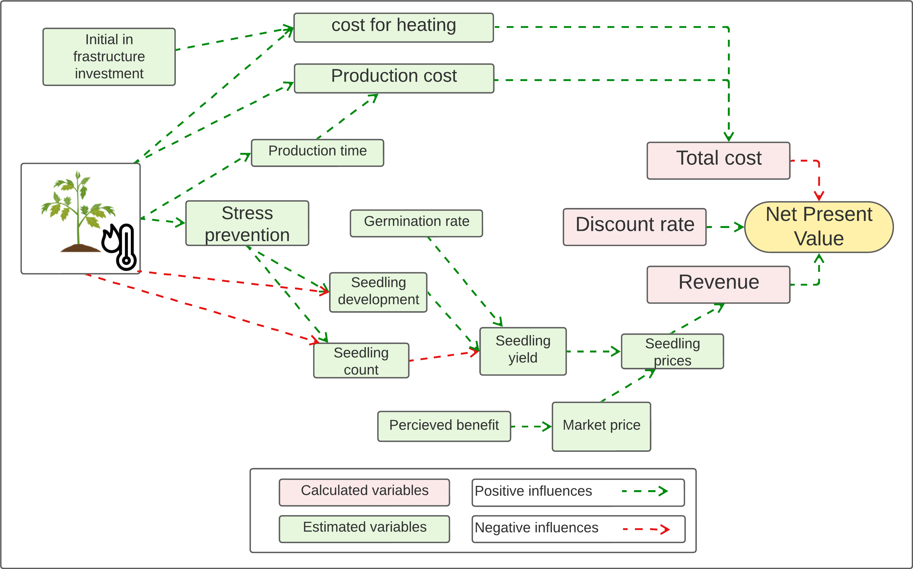
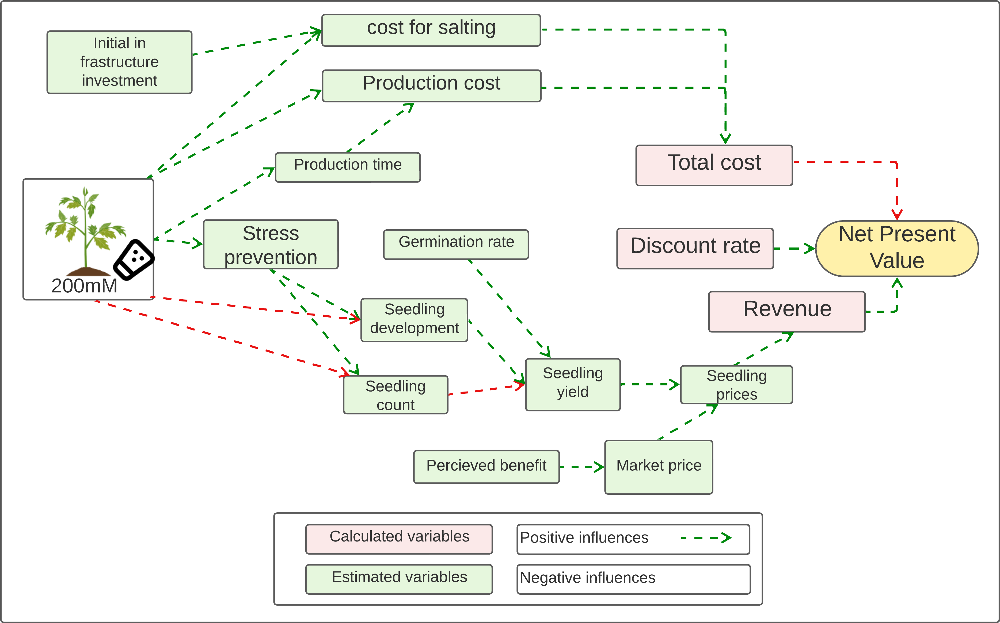

```{r setup, include=FALSE}
knitr::opts_chunk$set(
  echo = TRUE, # show all code
    tidy = FALSE, # cleaner code printing
    size = "small", # smaller code
    
    fig.path = "figures/", #graphics location
    out.width = "70%",

    message = FALSE,
    warning = FALSE
)
```

# Models

-   Ecomomic model
    -   3 seedling models (Heat priming, Salt priming (100mM), Salt
        priming (200mM))
    -   3 Tomato models (Heat priming, Salt priming (100mM), Salt
        priming (200mM))
-   Ecological model
    -   seedling + Tomato production (cradle to gate)

# Economic model

## seedling models

### Heat priming



-   This is based on the experiment from Uni Geisenheim
-   climate chamber (Fitotron® HGC 0714, Weiss Technik GmbH,
    Reiskirchen, Germany):
    -   5.9 kWh

    -   90min, 40°C, 7 days

    -   154 plants in a chamber

    -   the thermopriming treatment—two weeks after sowing

    -   once per day starting at 11:30 a.m.—with a preceding and
        subsequent period of 30 min to increase and decrease the air
        temperature—with four durations

    -   One week after priming, the plant height of 90 min-primed plants
        was similar to the control but showed a longer internode length
        due to increased stem elongation

    -   After 3 WAP (Week after priming), no differences between height
        and stem elongation were found between all the primed groups as
        well as the control group. Thus, thermopriming initially
        increased plant height by elongation (based on an increased
        internode length), but in comparison to all primed groups, 90
        min was eventually most similar to the control.

        				

        			

### Salt priming (100mM)


### Salt priming (200mM)



## Tomato models

### Heat priming

### Salt priming (100mM)

### Salt priiming (200mM)

# Ecological model

## seedling + tomato


-   
