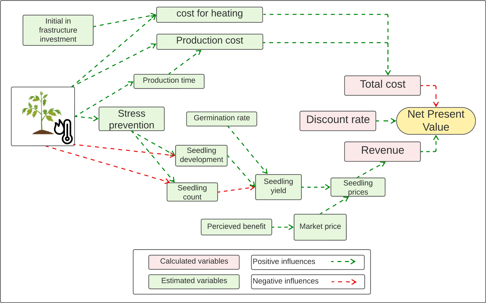
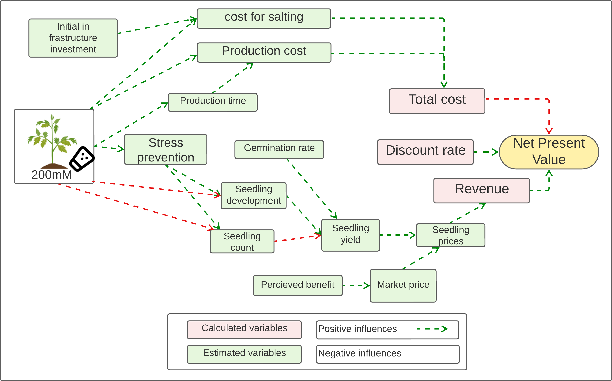
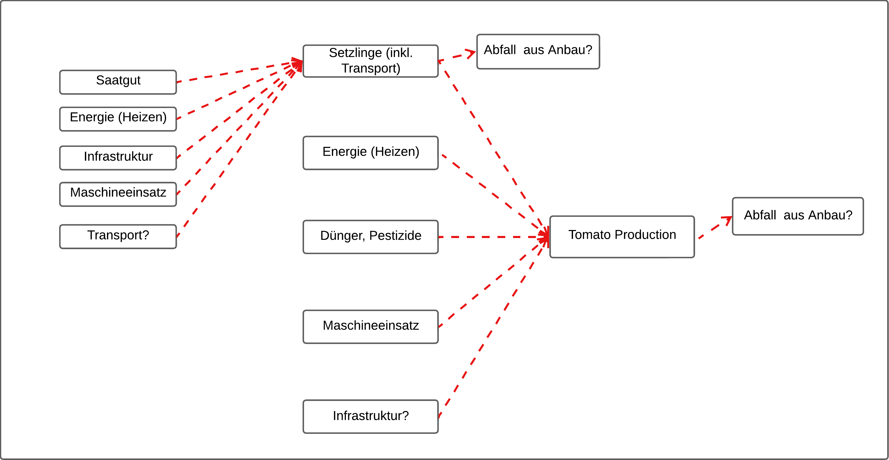

```{r setup, include=FALSE}
knitr::opts_chunk$set(
  echo = TRUE, # show all code
    tidy = FALSE, # cleaner code printing
    size = "small", # smaller code
    
    fig.path = "figures/", #graphics location
    out.width = "70%",

    message = FALSE,
    warning = FALSE
)
```

# Tomato

## Seedling

-   Transplant production requires 3–6 weeks (or as long as 8 weeks for
    grafted two-headed plants), depending on tem- perature and light
    conditions and stage of transplanting: either as plugs or as mature
    plants with visible first truss.

-   A good transplant is one that is as wide as it is tall and is not
    yet flowering. Supplemental light (50–100 μmol/m2/s photo- synthetic
    photon flux (PPF)) in situations with low natural light and carbon
    dioxide (CO2) enrichment (800–1000 μmol/mol) during transplant
    production increase plant growth rates and plant quality, and have
    been a practice in spe- cialized nurseries.

-   Seedlings for stone wool systems are generally started in a sterile
    inert me- dium, such as stone wool plugs at a density of around
    600–1000 plants/m2.

-   Use of coated seeds is common, which is especially advantageous for
    machine seeding and for uniform germination. Germination is often
    conducted in a separate compartment with controlled temperature and
    humidity suitable for germination. In some cases, especially for
    grafted seedlings, a sorting by size may be conducted at the
    cotyledon stage to create a more uniform seedling stand.

### Grafting

-   When second true leaves emergence

-   Grafting is normally conducted when **the second true leaf emerges**
    and is followed by 5–7 days of healing.

-   hand grafting is still common in most nurseries.

### Transplanting

-   plant density should be 20–22 plants/m2 during the transplanting
    stage

-   Sub-irrigation is always recommended, to minimize diseases on wet
    foliage. Transplanting into the final production greenhouse is
    performed just before the first flower opens (anthesis stage). This
    minimizes the time between transplanting and first harvest in the
    greenhouse and also ensures that the first flower grows out to a
    harvestable tomato fruit.

Mitigating salinity effects

-   Three cultural techniques that have proved useful in tomato to
    overcome, in part, the negative effects of salinity are: (i)
    treatment of seedlings with drought or NaCl, which ameliorates the
    adaptation of adult plants to salinity; (ii) mist (increasing
    humidity) applied to tomato plants, improving vegetative growth and
    yield in saline conditions; and (iii) grafting tomato cultivars on
    to appropriate rootstocks (Cuartero et al., 2006). In addition to
    enhancing tolerance of tomato against salinity, rootstocks reduce
    infection by soil-borne pathogens and relieve nutrient, water,
    thermal and pollutant stresses (Colla et al., 2010; Schwatz et al.,
    2010). Elevated CO2 concentration may also alleviate the negative
    effect of salinity on photosynthesis and plant growth (Maggio et
    al., 2002; Takagi et al., 2009). This effect was promoted under high
    sink-to-source activity, probably owing to improvement of oxidative
    stress as well as the water status through stomatal closure at high
    CO2 concentration (Takagi et al., 2009).

## Tomato

-   December planting, with production from March until November, is
    common practice at northern latitudes in the northern hemisphere.

-   Supplemental lighting is used to support plant growth and enable
    tomato production in periods with low natural light.

-   There is considerable interest in organic greenhouse tomato
    production. With organic production, crop production must be
    certified by an authorized organization that regulates the types of
    material that can be used. In Europe, hydroponics and soilless
    cultural practices are not allowed under organic schemes.

-   All guidelines relative to organic fertilizers and pesticides must
    be followed and the choice of cost-effective soluble organic
    fertilizers is still limited.

-   Use of high-analysis chemical fertilizers and most chemical
    pesticides is prohibited. Biological factors, such as soil condition
    and fertility and the use of beneficial insects, are the main
    factors used to assure a vital, healthy crop and good fruit quality.
    Total area of organic production in The Netherlands is 2% and that
    for tomato in the USA is 3% (USDA, 2013). (See Chapter 11 for
    organic cultivation.) -\> it have been changed.

-   Other factors, such as plant density, light intensity, CO2, air
    humidity, fruit load, plant age or salinity in the root envir-
    onment, have no or only a small effect on fruit growth period.
    Severe water stress shortens the duration of fruit growth period and
    fruit affected by blos- som-end rot will ripen 1–2 weeks earlier.

## Planting density/stem density

-   In a typical 3.2 m Venlo greenhouse span, there are four rows of
    tomato plants and two pathways.

-   In general, under north European conditions a plant density of 2.5
    plants/m2 has been found to give the best financial margin.

### Other crop managements

-   Five to eight weeks before the anticipated crop termination date,
    the growing point is removed. A week later, all remaining flowers
    are removed. An individual fruit requires 6–9 weeks from anthesis to
    harvest, so flowers or small fruits present after topping will not
    have enough time to develop to maturity. Some growers leave some
    shoots at the top (or do not top at all) to provide shade to top
    fruits and also increase the transpiration to reduce the risks of
    fruits cracking and russeting.

-   A greenhouse irrigation system should be able to provide at least 8
    l/m2 per day (80,000 l/ha per day). A mature tomato plant may use
    between 2 and 3 l/day (OMAFRA, 2003). Most of this water (90%) is
    used for transpiration and the rest for growth. Water use efficiency
    is much higher in greenhouses than in field production. To produce 1
    kg of fresh tomatoes, between 15 l and 60 l of irrigation water are
    required, depending on growing conditions and crop management
    (Stanghellini et al., 2003).

### Nutrient and irrigation management

-   Water consumption of 0.9 m3/m2/year is estimated for greenhouses in
    The Netherlands (Anonymous, 1995) and 0.8 m3/m2/year for British
    Columbia, Canada (Portree, 1996).

-   In a study reported by Sabeh et al. (2011), tomato production in a
    semi-arid greenhouse (located in Arizona) consumed 0.40–0.78 m3/m2
    over a 7-month period (early March to early October) while
    additional water consumption for pad-and-fan cooling was 1.45 m3/m2
    during this period.

### GREENHOUSE ENVIRONMENTAL CONTROL AND SYSTEMS

-   optimize temperature, relative humidity, CO2 concentration and light
    intensity.

-   Computers can control many mechanical devices within a greenhouse,
    such as vents, heaters, fans, evaporative pads, fogging, roof
    sprinklers, CO2 enrichment systems, irrigation valves, fertilizer
    injectors, shade-cloths and energy-saving curtains.

-   

-   in almost all regions, CO2 and irradiance (light intensity) are the
    most limiting factors for maximizing yield.

-   CO2 enrichment: Carbon dioxide can be added to the greenhouse in
    several ways. Natural gas or propane burners hooked up to sensors
    can be used to generate CO2. Different fuel sources provide
    different amounts of CO2. Burning 1 m3 of natural gas, 1 l of
    kerosene or 1 l of propane provides 1.8 kg, 2.4 kg and 5.2 kg of
    CO2, re- spectively (Portree, 1996).

-   CO2 sources in greenhouses add heat, water vapor, and potential
    pollutants. Condensing water vapor and using low NOx burners can
    minimize risks. Ethylene, a pollutant causing plant disorders, is
    the most expensive but safe option. Compressed or liquid CO2 is the
    safest option, with some areas in The Netherlands having
    distribution nets. Regular calibration of CO2 concentration sensors
    and uniform distribution are crucial for efficient utilization.

-   CO2 enrichment to 750–800 μmol/mol increases yields compared with
    standard outside conditions (about 390 μmol/mol).

### Organic farming

-   High production risks related to limited effective tools for pest,
    disease and weed management still constitute a major barrier for the
    expansion of organic farming. Therefore, new biological control
    agents, biopesticides and cultural practices increasing plant
    resilience to biotic and abiotic stresses as well as a balanced
    nutrient supply following plant demands without any leaching or
    emission into the environment have to be used and optimized to make
    organic tomato production competitive. More research is needed on
    the nutritive value of organic tomato, though lower pesticide
    residues compared with convention- ally grown tomatoes is clear. The
    enhancement of microbial, floral and faunal diversity as a result of
    the use of different types of organic amendments also needs further
    verification and publication.

# Models

-   Ecomomic model
    -   3 seedling models (Heat priming, Salt priming (100mM), Salt
        priming (200mM))
    -   3 Tomato models (Heat priming, Salt priming (100mM), Salt
        priming (200mM))
-   Ecological model
    -   seedling + Tomato production (cradle to gate)

# Economic model

## seedling models

### Heat priming



-   This is based on the experiment from Uni Geisenheim
-   climate chamber (Fitotron® HGC 0714, Weiss Technik GmbH,
    Reiskirchen, Germany):
    -   5.9 kWh

    -   90min, 40°C, 7 days

    -   154 plants in a chamber

    -   the thermopriming treatment—two weeks after sowing

    -   once per day starting at 11:30 a.m.—**with a preceding and
        subsequent period of 30 min to increase and decrease the air
        temperature**—with four durations

    -   One week after priming, the plant height of 90 min-primed plants
        was similar to the control but showed a longer internode length
        due to increased stem elongation

    -   After 3 WAP (Week after priming), no differences between height
        and stem elongation were found between all the primed groups as
        well as the control group. Thus, thermopriming initially
        increased plant height by elongation (based on an increased
        internode length), but in comparison to all primed groups, 90
        min was eventually most similar to the control.

    -   enhance thermotolerance

### Salt priming (100mM)

-   by jasmonic acid (JA;

-    salicylic acid SA

### Salt priming (200mM)



## Tomato models

### Heat priming

### Salt priming (100mM)

### Salt priiming (200mM)

# Ecological model

## seedling + tomato



-   

# Meeting

## 5th project meeting

ideas from the meeting

-   landtechnik engineer to ask how can be possible to use Priming in
    Praxis

-   compare big producers and small producers

-   not realistic about less pesticides....

-   calibration workshop (?)

-   berater

## LCA-Leo

-   <https://www.iso.org/standard/38498.html>

-   
